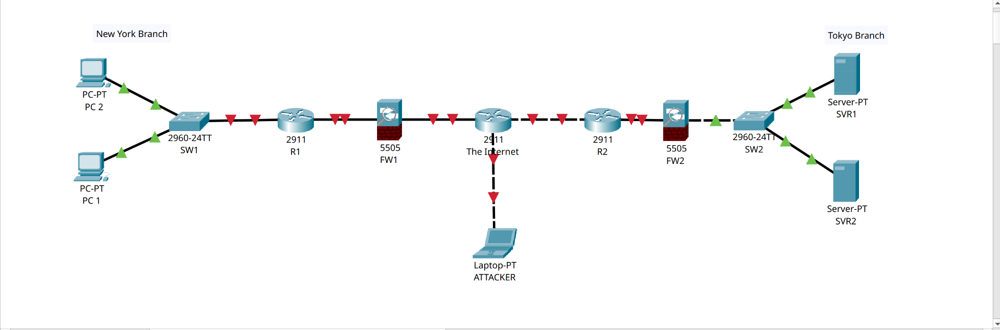

# CCNA Networking & Security Labs

Welcome to my portfolio of hands-on networking labs. This repository serves as documentation for my technical progression through Jeremy's IT Lab CCNA curriculum as I pivot into the cybersecurity field.

---

## Lab 1: Enterprise Branch Network Architecture

### 🎯 Objective
To build a multi-branch corporate network topology using Cisco Packet Tracer, simulating secure connections between a New York branch, a Tokyo branch, the public Internet, and edge security boundaries.

### 🖼️ Network Topology Diagram

### 🛠️ Hardware & Devices Simulated
* **Cisco 2911 Routers (x3):** Routing traffic across the New York branch, Tokyo branch, and public ISP core.
* **Cisco 2960 Switches (x2):** Handling local Layer 2 traffic aggregation within the branches.
* **Cisco ASA 5505 Firewalls (x2):** Established at the boundary zones to inspect traffic.
* **Endpoints:** Internal PCs (NY), Enterprise Servers (Tokyo), and an external simulated Attacker Laptop.

### 🛡️ Cybersecurity Takeaway
This architecture establishes a fundamental **Perimeter Defense** model. By placing firewalls between trusted internal branches and the untrusted public Internet core (where the attacker resides), we successfully isolate private network segments. This setup demonstrates why zero-trust boundaries are required at the WAN edge to protect enterprise endpoints and data assets from unauthorized external access.
