# Enterprise Infrastructure & Security Architecture Portfolio

Welcome to my technical portfolio documenting hands-on infrastructure engineering and perimeter security environments. This repository tracks environments built using **Cisco Packet Tracer** aligned with the **Cisco CCNA (200-301)** framework, purposefully engineered to build a solid foundation for enterprise cybersecurity.

---

## Architecture 01: Multi-Branch Enterprise WAN & Edge Security Boundary

### 🌐 System Overview
Engineered a simulated multi-branch corporate network topology to establish routing layouts, Layer 2 distribution switching, and perimeter firewall security architecture between distinct geographic operations (New York Branch & Tokyo Data Center) across an untrusted public WAN.

### 🖼️ Network Topology Diagram

### 🛠️ Hardware Inventory & Role Profiles
* **Cisco 2911 ISR Core Routers (x3):** Configured to execute edge routing and simulate a public Internet Service Provider (ISP) backbone routing matrix.
* **Cisco ASA 5505 Security Appliances (x2):** Deployed at the WAN boundaries of both operational branches to serve as primary stateful packet filtering firewalls.
* **Cisco 2960 Catalyst Switches (x2):** Provisioned for localized Layer 2 local loop aggregation and endpoint traffic delivery.
* **Nodes & Threat Vectors:** Integrated internal corporate endpoints (NY-PC1, NY-PC2), remote production storage nodes (Tokyo-SVR1, Tokyo-SVR2), and an unauthenticated external node to simulate a public Threat Actor platform.

### 🛡️ Network Segmentation & Security Analysis
This deployment establishes a classic baseline for network isolation and defense-in-depth. By treating the public ISP router as an inherently untrusted zone, the installation of stateful Cisco ASA firewalls enforces strict perimeter access-control boundaries. This design protects critical data center servers from direct public exposure and effectively minimizes the corporate lateral movement attack surface should a standalone endpoint become compromised.

---

## Architecture 02: OSI Layer 1 Media Standards & Interface Infrastructure

### 🌐 System Overview
Configured physical layer topographies across a multi-tier enterprise backbone network. The objective focused on the manual selection of Layer 1 media pipelines to establish stable hardware links between diverse data networking elements.

### 🖼️ Network Topology Diagram
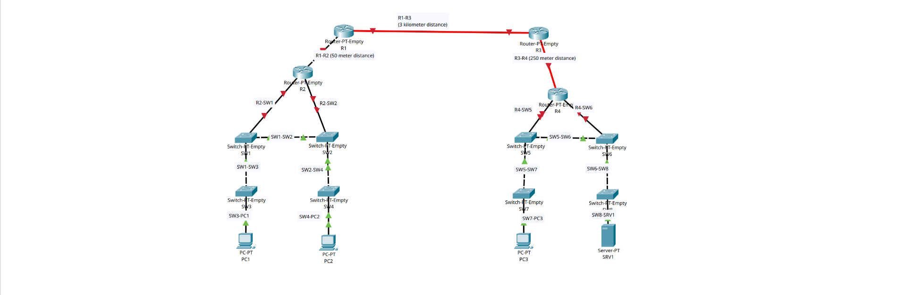

### 🛠️ Media Architecture & Interface Controls
* **Copper Straight-Through (TIA/EIA-568B):** Deployed to interlink heterogeneous hardware boundaries including Switch-to-Router and Switch-to-Endpoint interfaces.
* **Copper Cross-Over:** Provisioned to interconnect homogeneous networking layers (Switch-to-Switch) to correctly align pinout transmit (TX) and receive (RX) channels under static configurations.
* **Single-Mode Fiber Optic (SMF):** Strategically provisioned on long-range core transit pipes (R1 to R3) to support localized multi-kilometer backhaul transport constraints (3km scale).
* **Multi-Mode Fiber Optic (MMF):** Deployed over mid-range structural links (750m scale) optimized for high-bandwidth internal campus interconnections.

### 🛡️ Physical Layer Risk Mitigation
Layer 1 architecture serves as the foundation for the entire security posture. Standard copper twisted-pair cabling continuously emits electromagnetic interference (EMI) fields that can potentially be exploited via passive electromagnetic wiretapping devices to capture raw frames without altering the interface up-state. 

Transitioning the core backbone routes to fiber optic media introduces a highly resilient security mechanism: fiber cables transmit data entirely as encapsulated light pulses, negating EMI radiation leakage. Any physical attempt to intercept or tap into the fiber optical line fundamentally disrupts the internal light refraction angles, immediately causing link degradation or absolute terminal downtime. This automatically alerts security monitoring frameworks to a physical breach attempt instantly.

---

## Architecture 03: OSI Model Encapsulation & Protocol Analysis

### 🌐 System Overview
Utilized Cisco Packet Tracer’s stateful Simulation Mode to capture, dissect, and map multi-layer protocol encapsulation patterns across localized segments and routed boundaries. The scope of this architecture focused on auditing real-time network control plane data (STP, OSPF) and application layer infrastructure queries (DHCP).

### 🖼️ Network Topology Diagram
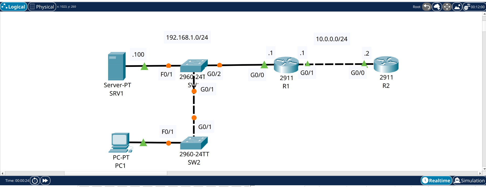

### 🔍 Task 1: Control Plane Traffic Analysis (STP & OSPF)
Analyzed background network infrastructure maintenance frames to observe layer-2 loop prevention mechanisms and layer-3 dynamic routing behaviors.

| Layer 2 Loop Prevention (STP) | Layer 3 Dynamic Routing (OSPF) |
| :---: | :---: |
| 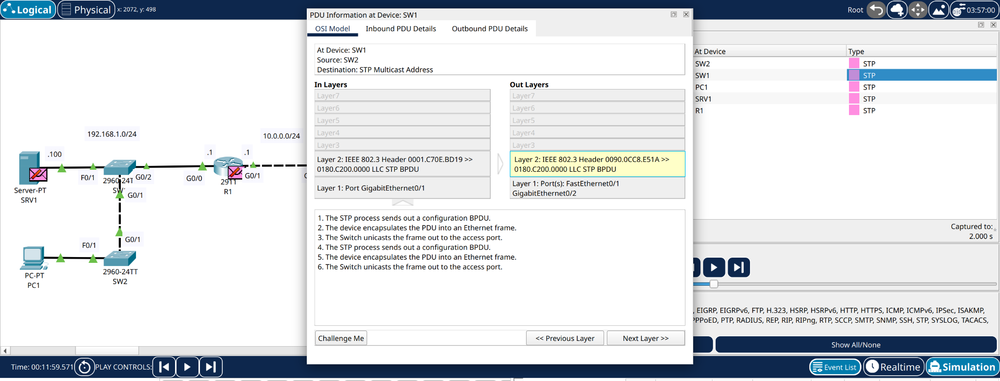 | 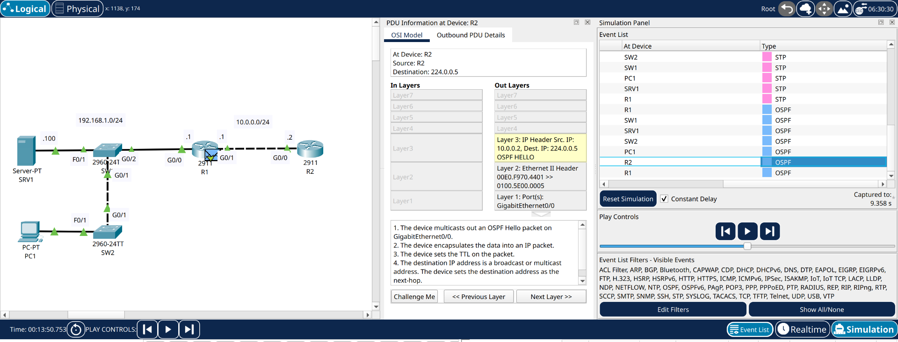 |

* **Spanning Tree Protocol (STP) Audit:** Captured IEEE 802.3 LLC Bridge Protocol Data Units (BPDUs) exchanged between Catalyst switches (SW1/SW2) to verify automated broadcast storm mitigation.
* **Open Shortest Path First (OSPF) Audit:** Captured OSPF Hello packets traversing network routing boundaries via IP multicast destination address `224.0.0.5`, verifying active neighbor discovery routines between routing elements (R1/R2).

---

### 🔍 Task 2: Application Layer Host Configuration (DHCP)
Simulated client-side dynamic IP assignment loops to track raw Protocol Data Unit (PDU) transformations across all 7 layers of the OSI stack.

| Host CLI IP Configuration | DHCP Discover PDU Encapsulation |
| :---: | :---: |
| 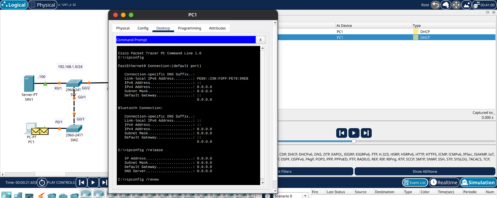 | 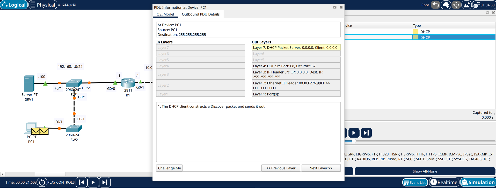 |

* **Client Trigger:** Executed `ipconfig /release` followed by `ipconfig /renew` from endpoint PC1 to trigger an unconfigured broadcast state (`0.0.0.0` address structure).
* **Encapsulation Breakdown:** Audited the outbound Layer 7 **DHCP Discover packet** as it cascaded down the protocol stack: Encapsulated into a Layer 4 UDP segment (Source Port 68, Destination Port 67), wrapped inside a Layer 3 IPv4 broadcast packet (Destination IP `255.255.255.255`), and finalized inside a Layer 2 Ethernet II broadcast frame (Destination MAC `FFFF.FFFF.FFFF`).

---

### 🛡️ Protocol Analysis & Security Insights
From an operational security perspective, analyzing these foundational packet headers is vital to defending an enterprise. Unencrypted local services like DHCP and control plane traffic like STP are prime targets for malicious actors. 

Understanding how a DHCP Discover packet structures its broadcast layer allows engineers to build **DHCP Snooping** profiles on switches to prevent Rogue DHCP server insertion attacks. Similarly, analyzing STP BPDUs highlights why network administrators must configure **BPDU Guard** on host-facing access ports to ensure an attacker cannot inject unauthorized root bridge priorities and intercept internal traffic flows via layer-2 man-in-the-middle vectors.

---

## Architecture 04: Cisco IOS Basic Device Security & Endpoint Hardening

### 🌐 System Overview
Implemented fundamental security baselines and administrative access controls across Cisco IOS routing and switching platforms (`R1` and `SW1`). The core focus centered on device identification, credential enforcement, and the structural differentiation between Type 7 symmetric password obfuscation and secure Type 5 cryptographic hashing sequences.

### 📄 Lab Requirements & Constraints Checklist
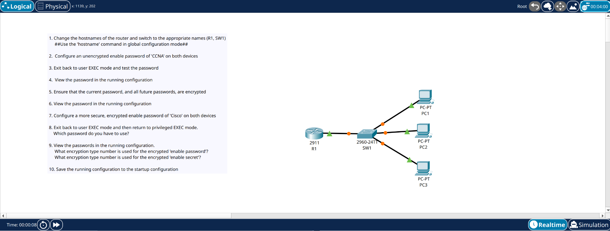

### 🖼️ Network Topology Diagram
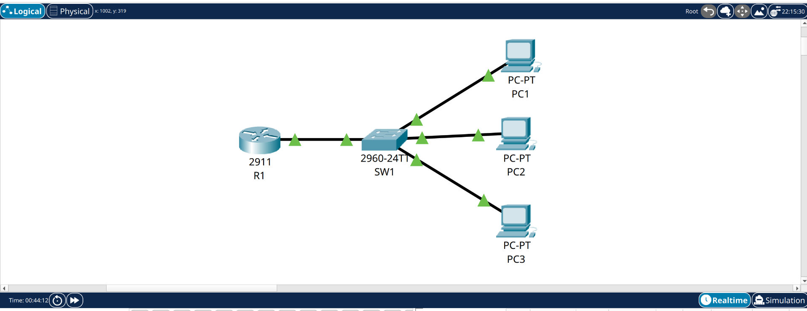

---

### 🔍 Task 1: Device Identity Management & Hostname Provisioning
Deprovisioned default generic platform tags across active command-line sessions to establish explicit infrastructure accountability controls.

| R1 Hostname Initialization | SW1 Hostname Initialization |
| :---: | :---: |
| 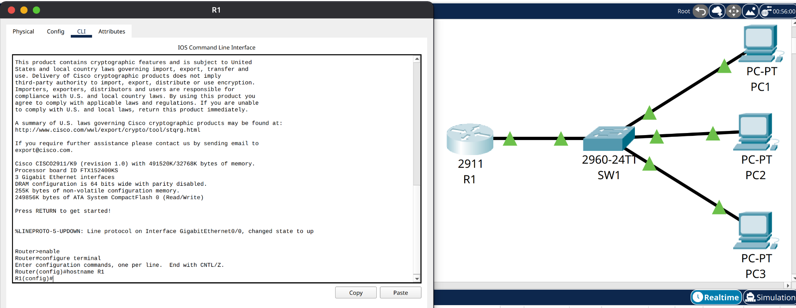 | 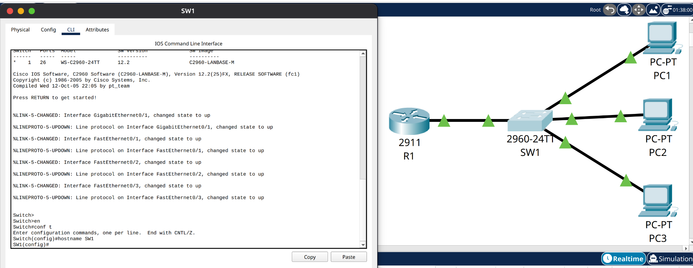 |

---

### 🔍 Task 2: Baseline Authentication Configuration
Configured standard privilege elevation parameters using clear-text operational strings to establish initial boundary permissions.

| R1 Authentication Baseline | SW1 Authentication Baseline |
| :---: | :---: |
| 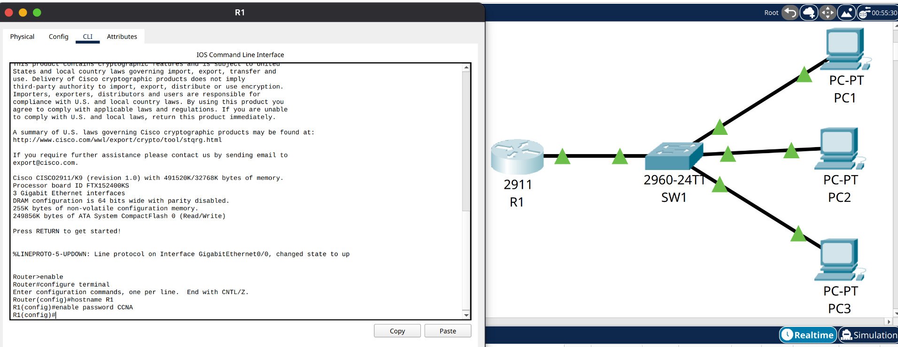 | 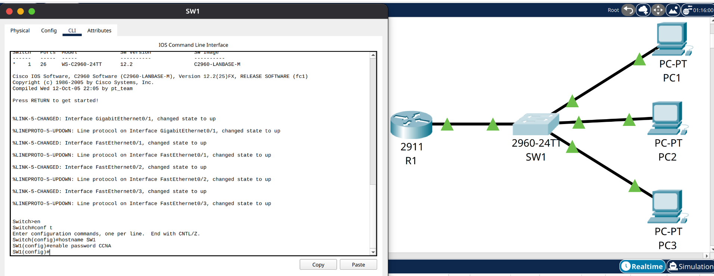 |

---

### 🔍 Task 3: Privilege Elevation Verification Testing
Exited back to non-privileged user EXEC mode boundaries (`Router>` / `Switch>`) to actively audit credential challenges and verify interface configuration lockouts across both nodes.

| R1 Credential Challenge Verification | SW1 Credential Challenge Verification |
| :---: | :---: |
| 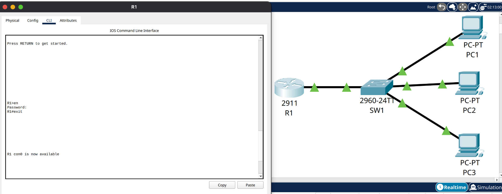 | 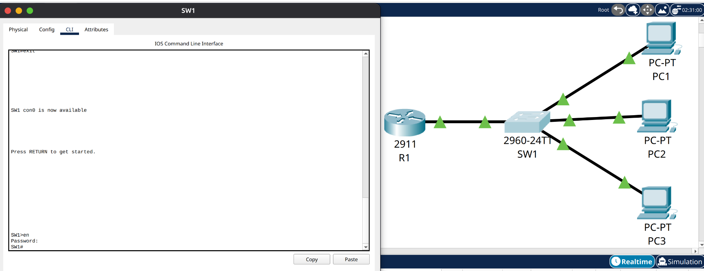 |

---

### 🔍 Task 4: Configuration Audit & Plaintext Exposure Verification
Executed configuration file audits to analyze running state properties and verify plaintext data exposure risks inside configuration files before system hardening.

| R1 Vulnerability Verification | SW1 Vulnerability Verification |
| :---: | :---: |
|  | 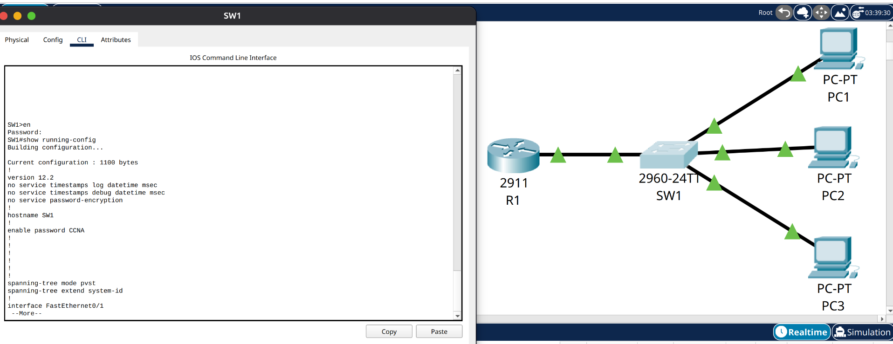 |

* **Vulnerability Analysis:** Running the configuration dump manually exposed `no service password-encryption` globally active alongside the raw string payload `enable password CCNA`. This verified that credentials were raw and readable to any user context traversing the console.

---

### 🔍 Tasks 5 & 6: Configuration Obfuscation & Verification (Type 7 Mitigation)
Provisioned global encryption daemons to scrub readable parameters from running data blocks, followed by an operational configuration audit to verify state conversion.

| R1 Type 7 Obfuscation Verification | SW1 Type 7 Obfuscation Verification |
| :---: | :---: |
| 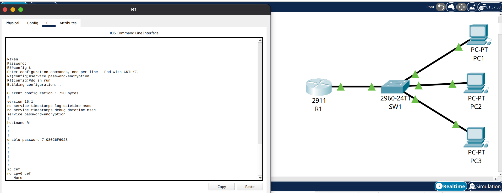 |  |

* **Hardening Implementation & Verification:** Invoked the global configuration parameter `service password-encryption` (Task 5). Running an immediate `show running-config` verification audit (Task 6) confirmed that the plaintext credential string converted successfully to an obfuscated `enable password 7 08224F5D28` flag across both control terminals.

---

### 🔍 Tasks 7 & 9: Cryptographic Hashing Implementation (Enable Secret)
Provisioned secure hashed authentication boundaries to replace legacy configuration blocks, manually auditing the distinct encryption type markers applied within the active configuration files (skipping administrative testing in Task 8).

| R1 Hashed Authentication Baseline | SW1 Hashed Authentication Baseline |
| :---: | :---: |
| 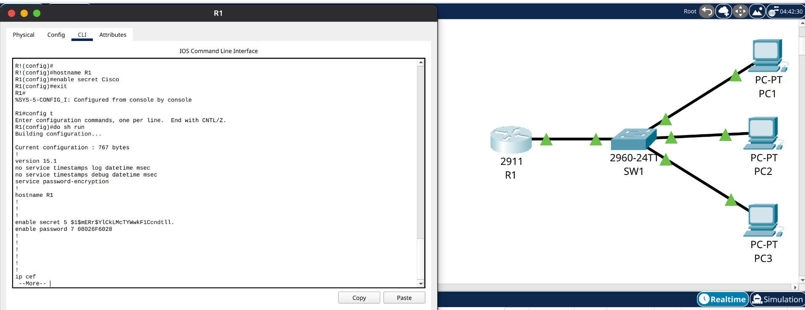 | 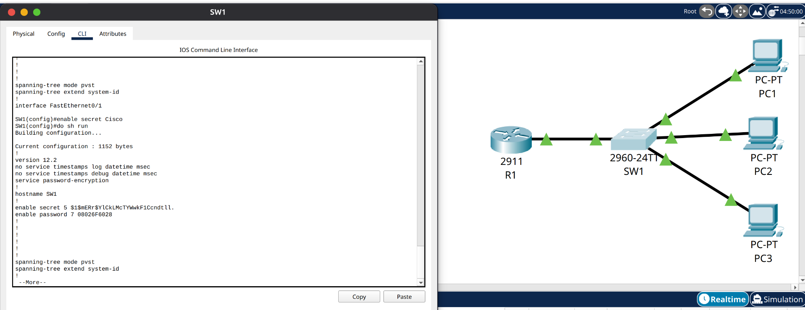 |

* **Cryptographic Deployment:** Enforced the `enable secret Cisco` directive across both core systems (Task 7). This automatically generated a secure one-way mathematical hash value to protect privileged EXEC layer access.
* **Encryption Type Verification (Task 9):** An operational configuration check allowed for a direct structural comparison of security algorithms within the system file:
  * **`enable password 7 ...`:** Marked with indicator **Type 7**, confirming a legacy, easily reversible symmetric cipher mechanism that is vulnerable to trivial offline decryption tools.
  * **`enable secret 5 ...`:** Marked with indicator **Type 5**, confirming the generation of a secure, one-way **Cisco MD5 hashing algorithm** sequence that successfully neutralizes credential harvesting scripts.

---

### 🔍 Task 10: State Retention & Non-Volatile Memory Commit
Committed all volatile active runtime configurations securely to permanent physical storage to guarantee long-term system state retention.

| R1 NVRAM State Commit | SW1 NVRAM State Commit |
| :---: | :---: |
| 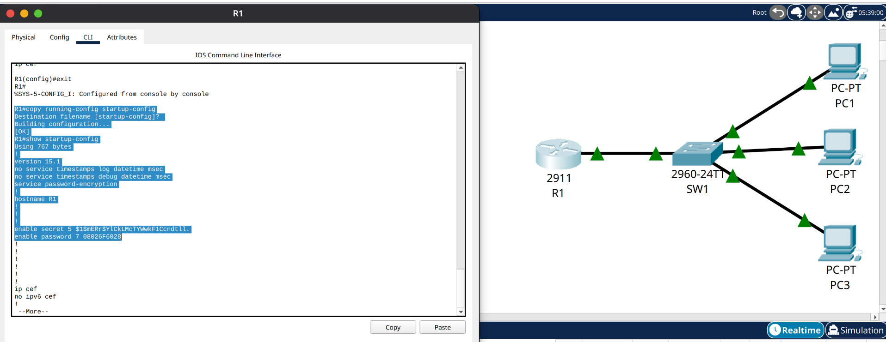 | 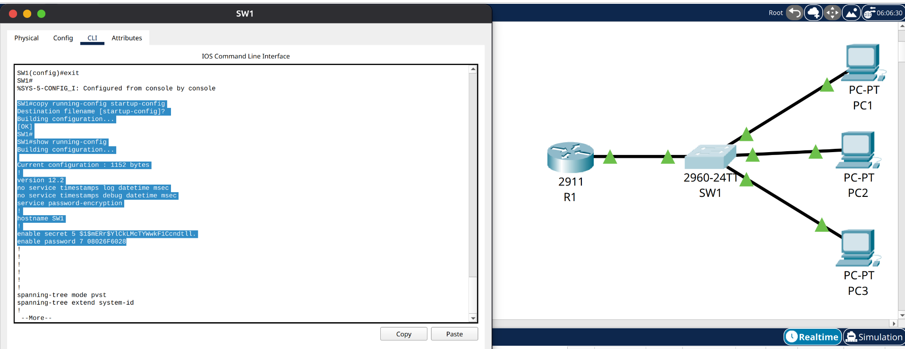 |

* **State Retention Execution:** Invoked the administrative command sequence `copy running-config startup-config` across both terminal instances. The prompt returns an explicit operational confirmation of `[OK]`, verifying that all configuration parameters and cryptographic hashes have migrated from volatile RAM arrays over to permanent, non-volatile NVRAM modules. This prevents a catastrophic loss of security architectures during unexpected physical hardware reboots or power loss loops.

---

### 🛡️ Network Segmentation & Security Analysis
This lab addresses a critical infrastructure vulnerability: **Plaintext Credential Exposure**. During initial configuration, deploying a standard clear-text password leaves system entry strings exposed to any user context traversing the local interfaces. 

Two vital architectural security behaviors were verified during this hardening exercise:
1. **Obfuscation vs. Strong Encryption:** Type 7 symmetric strings act merely as an obfuscation layer to prevent "over-the-shoulder" viewing; they contain no true algorithmic strength and are trivially decoded. Conversely, the Type 5 MD5 hash utilizes a secure one-way function that prevents mathematical reversal, forcing attackers to attempt compute-heavy brute-force attacks rather than direct deciphering.
2. **Command Precedence & Privilege Isolation:** When both commands are implemented concurrently on a Cisco platform, the IOS command architecture automatically gives precedence to the highly secure `enable secret` parameter over the weaker `enable password`. This ensures that even if a legacy password remains in the configuration file, the operating system enforces the stronger cryptographic boundary during log-in challenges.
